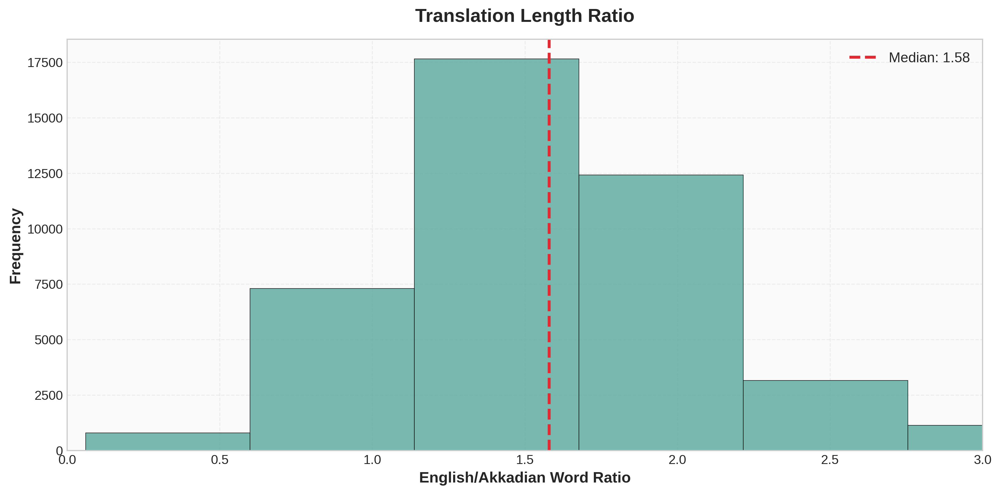

# Akkadian → English Machine Translation  
**Deep Past Challenge (Kaggle)**

<table width="100%" cellspacing="0" cellpadding="0">
  <tr>
    <td width="50%" style="padding:0; margin:0;">
      
    </td>
    <td width="50%" style="padding:0; margin:0;">
      
    </td>
  </tr>
</table>

This project investigates neural machine translation of Old Assyrian cuneiform texts from Akkadian transliteration into English. The corpus consists primarily of commercial and administrative documents from ancient Mesopotamian trade networks, dating to approximately 1900–1700 BCE.

The goal is to evaluate how modern sequence-to-sequence transformer models perform on carefully preprocessed and sentence-aligned Akkadian–English parallel data.

---

## 1. Data

### 1.1 Sources

<table>
  <tr>
    <td width="600" valign="top">
      
    </td>
    <td valign="top">
      Training data was assembled from two sources:
      <ol>
        <li><b>Akkademia</b> — a pre-aligned Akkadian–English parallel corpus</li>
        <li><b>Deep Past Kaggle competition data</b> — official training material</li>
      </ol>
      After preprocessing and alignment, the final dataset contains <b>43,746</b> sentence-level pairs.
    </td>
  </tr>
</table>

---

## 2. Preprocessing

Akkadian transliterations include numerous editorial conventions and scribal annotations that are not suitable for direct input to neural machine translation models. A custom preprocessing pipeline was implemented to normalize the text.

### 2.1 Scribal notation removal

## 2. Preprocessing

Akkadian transliterations include editorial conventions (line numbers, damage markers, brackets, etc.) that are not suitable for direct input to neural machine translation models. I implemented a lightweight preprocessing class to normalize the text before sentence splitting and training.

**Note on implementation details.** Parts of the character-mapping table (e.g., Unicode subscripts and diacritics to normalized ASCII-friendly forms) were generated with the help of an LLM from written specifications, mainly to avoid manually typing a long mapping. If you reuse this code for other corpora or transliteration conventions, it is worth double-checking the mappings against your expected standard.

Determinatives such as `{d}` (deity), `{ki}` (place), and `{m}` (person) function as semantic classifiers rather than lexical items. These were removed entirely to reduce sparsity and noise in the training data.
Orthographic variation and special characters were normalized to consistent ASCII-friendly forms:
- `á → a2`, `š → sz`, `ṣ → s,`, etc.

**Example**
```text
Before: 5 a-na {m}A-šùr-ma-lik qí-bí-ma [!]
After:  a-na A-szur-ma-lik qi2-bi-ma
````

```python
class AkkadianPreprocessor:
    """Clean and preprocess Akkadian texts.
       Optional: lexicon-based PN/GN tagging."""
    
    def __init__(self, lexicon_df=None):
        self.lexicon = lexicon_df
        self.has_lexicon = lexicon_df is not None

        self.char_replacements = {
            '₀': '0', '₁': '1', '₂': '2', '₃': '3', '₄': '4',
            '₅': '5', '₆': '6', '₇': '7', '₈': '8', '₉': '9', '₊': 'x',
            'á': 'a2', 'à': 'a3', 'é': 'e2', 'è': 'e3',
            'í': 'i2', 'ì': 'i3', 'ú': 'u2', 'ù': 'u3',
            'š': 'sz', 'Š': 'SZ', 'ṣ': 's,', 'Ṣ': 'S,',
            'ṭ': 't,', 'Ṭ': 'T,', 'ḫ': 'h', 'Ḫ': 'H', 'ʾ': "'",
        }

        if self.has_lexicon:
            self._build_lexicon_lookups()

    def _build_lexicon_lookups(self):
        self.form_to_type = {}
        for _, row in self.lexicon.iterrows():
            form = str(row.get('form', '')).strip().lower()
            typ = row.get('type', None)
            if form and form != 'nan' and pd.notna(typ):
                self.form_to_type[form] = str(typ).strip()

        self.person_names = {f for f, t in self.form_to_type.items() if t == 'PN'}
        self.place_names  = {f for f, t in self.form_to_type.items() if t == 'GN'}

    def clean_text(self, text, is_akkadian=True, tag_proper_nouns=False):
        if pd.isna(text) or str(text).strip() == "":
            return ""

        text = str(text)

        # remove line numbers
        text = re.sub(r'(?:^|\n)\s*\d+\'*\s*', ' ', text)

        # remove scribal notations
        text = text.replace('!', '').replace('?', '').replace('/', ' ')
        text = re.sub(r'<([^>]+)>', r'\1', text)
        text = re.sub(r'<<([^>]+)>>', r'\1', text)
        text = re.sub(r'[˹˺]', '', text)
        text = re.sub(r'\[([^\]]+)\]', r'\1', text)

        # remove gaps / ellipses entirely
        text = re.sub(r'<big[_\s]?gap>', '', text, flags=re.IGNORECASE)
        text = re.sub(r'<gap>', '', text, flags=re.IGNORECASE)
        text = re.sub(r'\[x\]', '', text, flags=re.IGNORECASE)
        text = re.sub(r'\.\.\.', '', text)
        text = text.replace('…', '')

        # remove determinatives completely
        text = re.sub(r'\{[^}]+\}', '', text)

        # normalize characters (akkadian only)
        if is_akkadian:
            for old, new in self.char_replacements.items():
                text = text.replace(old, new)

        # whitespace normalize early so tokenization is stable
        text = re.sub(r'\s+', ' ', text).strip()

        # optional: tag PN/GN using lexicon
        if tag_proper_nouns and self.has_lexicon and is_akkadian:
            words = text.split()
            out = []
            for w in words:
                key = w.replace('-', '').lower()
                if key in self.person_names:
                    out.append(f"[PN]{w}[/PN]")
                elif key in self.place_names:
                    out.append(f"[GN]{w}[/GN]")
                else:
                    out.append(w)
            text = ' '.join(out)

        return text
```


---

## 3. Sentence-level alignment

The evaluation format of the competition is sentence-based, whereas part of the training data is document-level. Automatic sentence splitting and alignment was performed using:

* line structure in Akkadian transliterations
* punctuation-based splitting for English
* retention only of cases with clean 1-to-1 correspondence

This process increased the effective training data from approximately 1,500 documents to **43,746 aligned sentence pairs**.

---

## 4. Data characteristics

### 4.1 Length distributions


English translations are typically longer than Akkadian transliterations, with a median length ratio of **1.58:1**.



**Summary statistics**

* Avg. Akkadian words: **13.1** per sentence
* Avg. English words: **21.7** per sentence
* Avg. Akkadian characters: **105.9**
* Avg. English characters: **120.4**

### 4.2 Vocabulary


* Akkadian vocabulary size: **74,114** unique tokens
* English vocabulary size: **46,588** unique tokens
* Vocabulary diversity (Akkadian): **0.129**
* Vocabulary diversity (English): **0.049**

The higher diversity in Akkadian reflects morphological richness and transliteration variability.

### 4.3 Frequent Akkadian tokens


High-frequency terms are dominated by prepositions, function words, and administrative vocabulary, consistent with the commercial nature of the corpus.

---

## 5. Model

The translation model is based on **NLLB-200 (distilled 600M)**
(`facebook/nllb-200-distilled-600M`).

Initial experiments with a smaller model showed early performance saturation. The 600M-parameter NLLB model provided sufficient capacity and strong multilingual representations to adapt to the domain-specific characteristics of Akkadian transliteration.

---

## 6. Training

**Configuration**

* batch size: **6** (per device)
* gradient accumulation: **4** (effective batch size 24)
* learning rate: **3e-5** with warmup
* optimizer: **AdamW**
* epochs: **3**
* precision: **FP16**

**Evaluation metrics**

* competition metric: geometric mean of **BLEU** and **chrF++**
* BLEU and chrF++ tracked individually

---

## 7. Results

**Test set**

* Geometric mean: **[TO BE FILLED]**
* BLEU: **[TO BE FILLED]**
* chrF++: **[TO BE FILLED]**
* Leaderboard position: **[TO BE FILLED]**

| Model            | Geometric Mean | BLEU  | chrF++ |
| ---------------- | -------------- | ----- | ------ |
| Smaller baseline | [TBF]          | [TBF] | [TBF]  |
| NLLB-200 (600M)  | [TBF]          | [TBF] | [TBF]  |

---

## 8. Examples

```text
Akkadian: KISZIB ma-nu-ba-lu2m-a-szur DUMU s,i2-la2-(d)IM ...
English:  Seal of Mannum-balum-Aššur son of Ṣilli-Adad, ...
```

```text
Akkadian: TÚG sza qa2-tim i-tur4-DINGIR il5-qe2...
English:  Itūr-ilī has received one textile of ordinary quality....
```

```text
Akkadian: TÚG u-la i-di2-na-ku-um i-tu3-ra-ma 9 GÍN KÙ.BABBAR...
English:  he did not give you a textile. He returned and 9 shekels of silver...
```

---

## 9. Reproducibility

```bash
python train.py \
  --model facebook/nllb-200-distilled-600M \
  --data final_training_data.csv \
  --batch_size 6 \
  --grad_accum 4 \
  --lr 3e-5 \
  --epochs 3
```

---

## 10. References

1. NLLB Team (2022). *No Language Left Behind: Scaling Human-Centered Machine Translation.* arXiv:2207.04672
2. Akkademia (Gutherz et al.), GitHub repository
3. Deep Past Initiative, Kaggle competition

---

## Dataset summary


