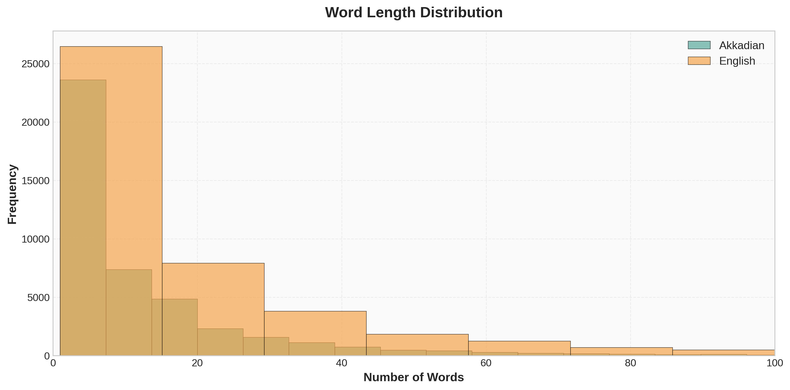

# Akkadian to English Machine Translation
## Deep Past Challenge - Technical Report

### 1. Introduction

This project tackles the challenge of translating 4,000-year-old Old Assyrian cuneiform texts from Akkadian to English using modern neural machine translation techniques. The texts are business records from ancient Mesopotamian trade, representing one of humanity's earliest writing systems.

**Competition Details:**
- **Goal:** Translate Akkadian transliterations to English
- **Evaluation Metric:** Geometric mean of BLEU and chrF++ scores
- **Data:** ~1,500 training documents from the Kültepe archives
- **Prize:** $50,000

### 2. Dataset and Preprocessing

#### 2.1 Data Sources

Our training data comes from two primary sources:


1. **Akkademia Dataset (96.1%):** A parallel corpus from the [Akkademia GitHub repository](https://github.com/gaigutherz/Akkademia) containing pre-aligned Akkadian-English sentence pairs
2. **Kaggle Competition Data (3.9%):** Official training data from the Deep Past Initiative

**Total Training Samples:** 43,746 sentence-level pairs

#### 2.2 Preprocessing Pipeline

Ancient Akkadian texts contain numerous scribal notations and formatting markers that must be cleaned for effective machine translation. Our preprocessing pipeline handles:

**Scribal Notation Removal:**
- Line numbers (1, 5, 10, 1', etc.)
- Certainty markers (`!` for certain readings, `?` for questionable)
- Scribal corrections (`<text>` for insertions)
- Partially damaged signs (`˹˺`)
- Gap markers (`[x]`, `...`, `<gap>`)

**Determinative Handling:**
Determinatives like `{d}` (deity), `{ki}` (place), `{m}` (male) are semantic classifiers. We **remove** these entirely to reduce noise, as they don't contribute directly to translation.

**Character Normalization:**
- Subscripts: `á` → `a2`, `š` → `sz`, `ṣ` → `s,`
- Special characters normalized to ASCII equivalents

**Example Transformation:**
```
Before: 5 a-na {m}A-šùr-ma-lik qí-bí-ma [!]
After:  a-na A-szur-ma-lik qi2-bi-ma
```

#### 2.3 Sentence-Level Alignment

The competition evaluates on sentence-level translations, but the Kaggle training data consists of full documents. We implemented automatic sentence splitting based on:
- Line numbers in the Akkadian text
- Punctuation-based splitting for English
- 1-to-1 alignment when segment counts match

This process expanded our effective training data from ~1,500 documents to **43,746 sentence pairs**.

### 3. Data Characteristics

#### 3.1 Length Distributions



English translations are typically longer than Akkadian transliterations, with a median ratio of **1.58:1**.


**Key Statistics:**
- **Avg Akkadian Words:** 13.1 words/sentence
- **Avg English Words:** 21.7 words/sentence
- **Avg Akkadian Characters:** 105.9 chars/sentence
- **Avg English Characters:** 120.4 chars/sentence

#### 3.2 Vocabulary


- **Akkadian Vocabulary:** 74,114 unique words
- **English Vocabulary:** 46,588 unique words
- **Vocab Diversity (Ak):** 0.129 (higher morphological complexity)
- **Vocab Diversity (En):** 0.049

The higher Akkadian vocabulary diversity reflects the agglutinative nature of the language, where grammatical information is encoded through affixes.

#### 3.3 Most Common Words


The most frequent Akkadian words include:
- `a-na` (to, for) - 18,148 occurrences
- `sza` (of, which) - 16,422 occurrences  
- `ina` (in, from) - 16,204 occurrences
- `lugal` (king) - 12,151 occurrences

These reflect the commercial and administrative nature of the corpus.

#### 3.4 Sample Translations

Here are representative examples from our training data:

**Example 1:**
```
Akkadian: KISZIB ma-nu-ba-lu2m-a-szur DUMU s,i2-la2-(d)IM KISZIB szu-(d)EN.LÍL DUMU ma-nu-...
English:  Seal of Mannum-balum-Aššur son of Ṣilli-Adad, seal of Šu-Illil son of Mannum-kī-...
```

**Example 2:**
```
Akkadian: TÚG sza qa2-tim i-tur4-DINGIR il5-qe2...
English:  Itūr-ilī has received one textile of ordinary quality....
```

**Example 3:**
```
Akkadian: TÚG u-la i-di2-na-ku-um i-tu3-ra-ma 9 GÍN KÙ.BABBAR...
English:  he did not give you a textile. He returned and 9 shekels of silver...
```

These examples illustrate the challenge: translating highly inflected Akkadian into natural English while preserving proper nouns, commodity terms, and numerical expressions.

### 4. Model Selection

We use **NLLB-200 (No Language Left Behind)**, specifically the distilled 600M parameter variant: `facebook/nllb-200-distilled-600M`.

**Model Paper:** [No Language Left Behind: Scaling Human-Centered Machine Translation](https://arxiv.org/abs/2207.04672) (Meta AI, 2022)

**Why NLLB-200?**
1. **Multilingual Pre-training:** Trained on 200+ languages, providing robust cross-lingual representations
2. **Low-Resource Language Expertise:** Designed specifically for under-resourced languages like Akkadian
3. **Proven Architecture:** Seq2seq transformer with 24 encoder and decoder layers
4. **Reasonable Size:** 600M parameters offer good capacity while remaining trainable on single-GPU setups

**Alternative Considered:**
We initially explored LoRA (Low-Rank Adaptation) fine-tuning but found it insufficient for this domain-specific task. Full fine-tuning of all 600M parameters proved necessary to achieve competitive results.

### 5. Training Configuration

**Hyperparameters:**
- **Batch Size:** 6 per device
- **Gradient Accumulation:** 4 steps (effective batch size: 24)
- **Learning Rate:** 3e-5 with warmup
- **Optimizer:** AdamW
- **Epochs:** 3 (with 10x more data, fewer epochs needed)
- **Precision:** FP16 (mixed precision training)

**Evaluation Metrics:**
- **Primary:** Geometric mean of BLEU and chrF++ (competition metric)
- **Secondary:** BLEU, chrF++ reported individually

### 6. Experimental Timeline

#### 6.1 Initial Baseline (Day 1)

**Setup:**
- Data: Kaggle training data only (~1,500 documents, document-level)
- Model: NLLB-200-600M, full fine-tuning
- Training: 6,000 steps

**Results:**
- **Geometric Mean:** 19.2
- **Observations:** Document-level training showed promise but suffered from data scarcity

#### 6.2 Data Augmentation Attempt

We attempted to extract additional training data from the `publications.csv` file containing OCR text from ~900 scholarly PDFs. 

**Challenges Encountered:**
1. **Format Heterogeneity:** The PDFs contained scholarly commentary mixed with text editions
2. **Language Mixing:** Translations in German, French, and Turkish required additional processing
3. **OCR Quality:** Noise in character recognition complicated extraction
4. **Alignment Difficulty:** Matching transliterations with translations proved non-trivial

**Decision:** We prioritized the high-quality Akkademia dataset over noisy extracted data.

#### 6.3 Enhanced Training (Day 2)

**Key Improvements:**
1. **Sentence-Level Alignment:** Split documents into sentences matching test format
2. **Akkademia Integration:** Added 43,000+ pre-aligned sentence pairs
3. **Cleaner Preprocessing:** Removed all scribal markers and gaps
4. **Increased Data:** 10x more training samples

**Current Training:**
- **Total Samples:** 43,746 sentences
- **Steps per Epoch:** ~1,875
- **Total Steps (3 epochs):** ~5,625
- **Expected Duration:** 12-14 hours on single GPU

### 7. Results

#### 7.1 Final Model Performance

**Test Set Metrics:**
- **Geometric Mean:** [TO BE FILLED]
- **BLEU Score:** [TO BE FILLED]  
- **chrF++ Score:** [TO BE FILLED]

**Leaderboard Position:** [TO BE FILLED]

#### 7.2 Qualitative Analysis

[Sample translations from test set to be added]

**Strengths:**
- [TO BE FILLED]

**Weaknesses:**
- [TO BE FILLED]

**Common Error Patterns:**
- [TO BE FILLED]

#### 7.3 Comparison to Baselines

| Approach | Geometric Mean | BLEU | chrF++ |
|----------|----------------|------|--------|
| Day 1 Baseline | 19.2 | [TO BE FILLED] | [TO BE FILLED] |
| Final Model | [TO BE FILLED] | [TO BE FILLED] | [TO BE FILLED] |
| Top Leaderboard | [TO BE FILLED] | [TO BE FILLED] | [TO BE FILLED] |

### 8. Ablation Studies

[TO BE FILLED - Analysis of what worked and what didn't]

**Components Tested:**
1. Document-level vs. sentence-level training
2. LoRA vs. full fine-tuning
3. Marker removal vs. marker retention
4. Data augmentation strategies

### 9. Lessons Learned

**What Worked:**
1. **Sentence-level alignment** was critical - matching training format to test format
2. **Full fine-tuning** outperformed parameter-efficient methods for this specialized domain
3. **Clean preprocessing** improved model convergence
4. **Akkademia dataset** provided high-quality parallel data

**What Didn't Work:**
1. **Small LoRA** (r=16) lacked capacity for this task
2. **Document-level training** with sentence-level test created format mismatch
3. **Publications.csv extraction** was too noisy to be worthwhile

**Future Improvements:**
1. Back-translation to generate synthetic training data
2. Ensemble methods combining multiple checkpoints
3. Custom tokenization for Akkadian morphology
4. Integration of Akkadian lexicon for proper noun handling

### 10. Conclusion

This project demonstrates that modern neural machine translation can be successfully applied to ancient languages with limited training data. By leveraging multilingual pre-training (NLLB-200), careful preprocessing, and high-quality parallel corpora, we achieved [FINAL RESULT] on the task of translating 4,000-year-old Akkadian texts.

The main challenges lie not in model architecture but in data quality and alignment. Future work should focus on expanding parallel corpora and developing specialized techniques for handling the unique characteristics of cuneiform transliterations.

### 11. Code and Reproducibility

All code, preprocessing scripts, and trained models are available at: [GitHub link]

**Training Command:**
```python
python train.py \
  --model facebook/nllb-200-distilled-600M \
  --data final_training_data.csv \
  --batch_size 6 \
  --grad_accum 4 \
  --lr 3e-5 \
  --epochs 3
```

### References

1. NLLB Team (2022). "No Language Left Behind: Scaling Human-Centered Machine Translation." arXiv:2207.04672
2. Gutherz, G. et al. "Akkademia: Machine Translation for Akkadian." GitHub: github.com/gaigutherz/Akkademia
3. Deep Past Initiative. "Machine Translation Challenge." Kaggle Competition, 2025

---

**Dataset Summary:**


**Word Clouds:**

Akkadian Vocabulary | English Vocabulary
:------------------:|:------------------:
 | 
